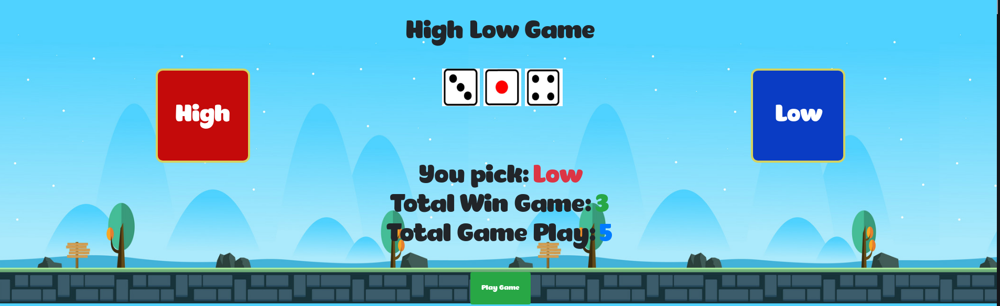

# Getting Started with Create React App

This project was bootstrapped with [Create React App](https://github.com/facebook/create-react-app).

## Project Description

This is a simple High Low Game. When player pick High or Low, it will display as You Pick. After player click Play Game, it will generate random dice numbers. To determine if the player win the bet or not will based on total dice point. If the total point number > 11 means high, the total point number <= 11 means low. Every time the player hit playgame, the number of total game play will increase by 1. If player win the bet, the number of total win game also increase by 1.

## Available Scripts

In the project directory, you can run:

### `yarn start`

Runs the app in the development mode.\
Open [http://localhost:3000](http://localhost:3000) to view it in the browser.

## Project view

